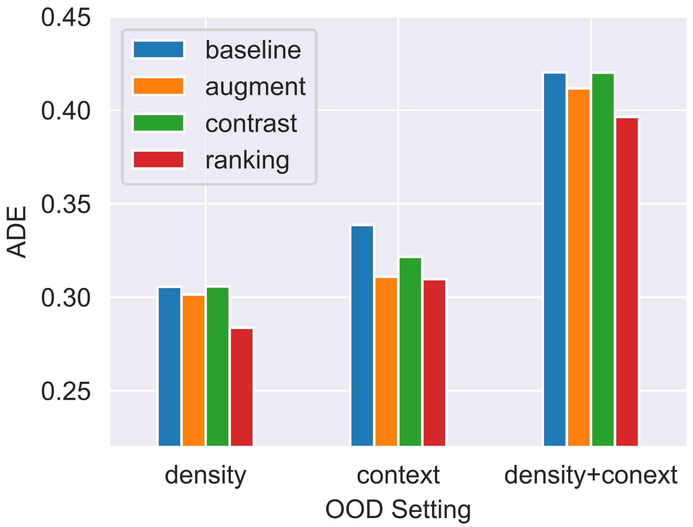
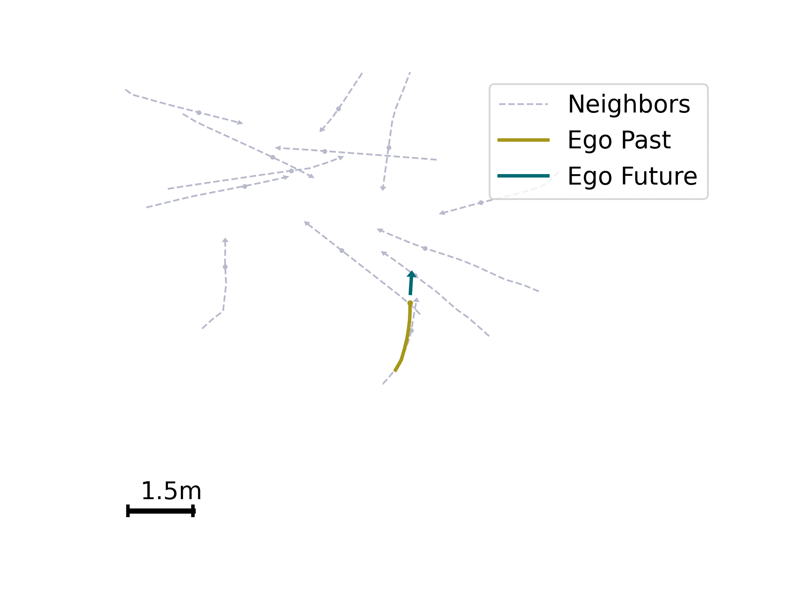
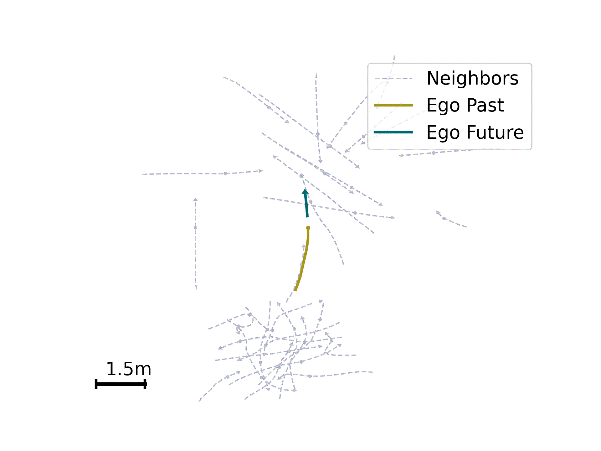
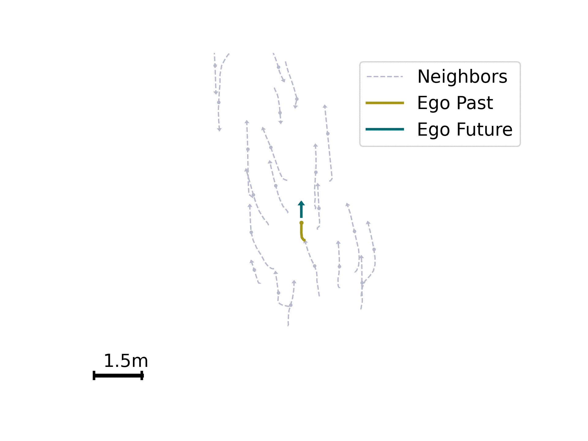
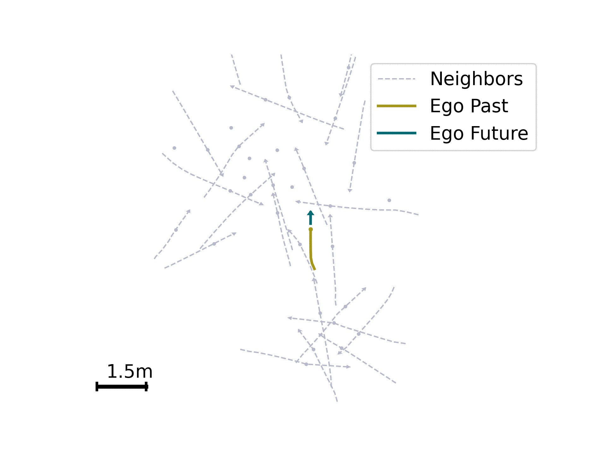

# Sim-to-Real Causal Transfer  
## A Metric Learning Approach to Causally-Aware Interaction Representations

📌 **Accepted at CVPR 2025**

---

Welcome! This is the official repository for our CVPR paper:

**"Sim-to-Real Causal Transfer: A Metric Learning Approach to Causally-Aware Interaction Representations"**

<p align="center">
  
</p>

> **TL;DR**  
> We investigate causal representation learning in the multi-agent context, from computational formalisms to controlled simulations to real-world applications.
>
> 1. We cast doubt on the notion of non-causal robustness in existing benchmarks, revealing that recent representations underestimate indirect causal effects.  
> 2. We introduce causal regularization techniques—contrastive and ranking—which improve causal awareness and out-of-distribution generalization.  
> 3. We propose a sim-to-real causal transfer framework, enabling practical, annotation-free causal learning from simulation to real-world domains.

<p align="center">
  
</p>

---

## ✅ What's Included

- [x] Synthetic experiments with AutoBots baseline
- [x] Sim-to-real causal regularization (contrastive and ranking)
- [ ] Code for generating the diagnostic dataset
- [ ] MultiTransmotion implementation and evaluation

---

## 📦 Getting Started

Install dependencies:
```bash
pip install -r requirements.txt
```

Download our diagnostic dataset: [Google Drive](https://drive.google.com/file/d/1j4heKWyUia4hYhKY6pjLteoN9o0kfeKe/view?usp=drive_link)

Dataset structure:
```
─── dataset-name
   ├── train
   │   ├── scene_0.pkl
   │   └── ...
   └── val
       ├── scene_0.pkl
       └── ...
```

---

## 🧪 Synthetic Experiments

### Baselines

AutoBots baseline:
```bash
python train.py --exp-id baseline --save-dir ./results --dataset-path <synth dataset path> --evaluate_causal
```

Data augmentation baseline:
```bash
python train.py --exp-id baseline --save-dir ./results --dataset-path <synth dataset path> --evaluate_causal --reg-type augment
```

### Causal Regularization

Contrastive:
```bash
python train.py --exp-id contrastive --save-dir ./results --dataset-path <synth dataset path> --evaluate_causal --reg-type contrastive     --weight-path <path to baseline checkpoint> --start-epoch 700
```

Ranking:
```bash
python train.py --exp-id ranking --save-dir ./results --dataset-path <synth dataset path> --evaluate_causal --reg-type ranking     --weight-path <path to baseline checkpoint> --start-epoch 700
```

### Evaluation
```bash
python evaluate.py --models-path <path to model> --dataset-path <ood dataset path>
```

---

## 🌍 Real-World Experiments (ETH-UCY)

### Baselines

AutoBots baseline:
```bash
python train.py --exp-id baseline --dataset s2r --reg-type contrastive --dataset-path <ETH-UCY path> --num-encoder-layers 1 --num-decoder-layers 1     --num-epochs 50 --learning-rate-sched 10 20 30 40 50 --low-data 1.0     --dataset-path-real <ETH-UCY path> --dataset-path-synth <synthetic path> --contrastive-weight 0.0 --save-dir ./results
```

Sim2Real (vanilla):
```bash
python train.py --exp-id vanilla --dataset s2r --reg-type baseline --dataset-path <ETH-UCY path> --num-encoder-layers 1 --num-decoder-layers 1     --num-epochs 50 --learning-rate-sched 10 20 30 40 50 --low-data 1.0     --dataset-path-real <ETH-UCY path> --dataset-path-synth <synthetic path> --save-dir ./results
```

Data augmentation:
```bash
python train.py --exp-id augment --dataset s2r --reg-type augment --dataset-path <ETH-UCY path> --num-encoder-layers 1 --num-decoder-layers 1     --num-epochs 50 --learning-rate-sched 10 20 30 40 50 --low-data 1.0     --dataset-path-real <ETH-UCY path> --dataset-path-synth <synthetic path> --save-dir ./results
```

### Causal Sim2Real

Contrastive:
```bash
python train.py --exp-id causal_contrastive --dataset s2r --reg-type contrastive --dataset-path <ETH-UCY path> --num-encoder-layers 1 --num-decoder-layers 1     --num-epochs 50 --learning-rate-sched 10 20 30 40 50 --low-data 1.0     --dataset-path-real <ETH-UCY path> --dataset-path-synth <synthetic path> --contrastive-weight <weight> --save-dir ./results
```

Ranking:
```bash
python train.py --exp-id causal_ranking --dataset s2r --reg-type ranking --dataset-path <ETH-UCY path> --num-encoder-layers 1 --num-decoder-layers 1     --num-epochs 50 --learning-rate-sched 10 20 30 40 50 --low-data 1.0     --dataset-path-real <ETH-UCY path> --dataset-path-synth <synthetic path> --ranking-weight <weight> --save-dir ./results
```

Evaluation:
```bash
python evaluate.py --dataset-path <test set> --models-path <model path> --dataset s2r
```

---

## 📊 Results

**Causal Awareness Comparison**
<p align="left">
  
</p>

**OOD Robustness Comparison**
<p align="left">
  
</p>

**Sim-to-Real Transfer Performance**
<p align="left">
  
</p>

---

## 🎥 Illustrations

| ID | OOD Density | OOD Context | OOD Context+Density |
|----|-------------|-------------|---------------------|
|  |  |  |  |

---


## 📚 Citation

If you use our work, please cite:

```bibtex
@InProceedings{Rahimi_2025_CVPR,
    author    = {Rahimi, Ahmad and Luan, Po-Chien and Liu, Yuejiang and Raji{c}, Frano and Alahi, Alexandre},
    title     = {Sim-to-Real Causal Transfer: A Metric Learning Approach to Causally-Aware Interaction Representations},
    booktitle = {Proceedings of the Computer Vision and Pattern Recognition Conference (CVPR)},
    month     = {June},
    year      = {2025},
    pages     = {17271-17281}
}
```

---

Thanks for your interest! Please feel free to open an issue or contact us with any questions.
